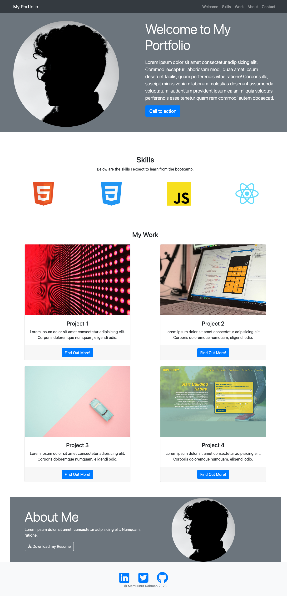

# Bootstrap Portfolio 

## Description

A responsive portfolio written using Bootstrap CSS Framework.
CSS is primarily from Bootstrap with minimal custom CSS styling. Responsive to all screen sizes and has working links which scroll to the corresponding sections.

## Links

[Link to the deployed website](https://mam-rahman.github.io/Bootstrap-Portfolio/)

[Link to the code repository](https://github.com/Mam-Rahman/Bootstrap-Portfolio)

[Link to previous website](https://mam-rahman.github.io/responsive-portfolio-css/)

## Installation

Upload the following files to the deployed webserver:

1. index.html
2. license.txt
3. both css and images folders which hold asset files

## Usage

## License

MIT License